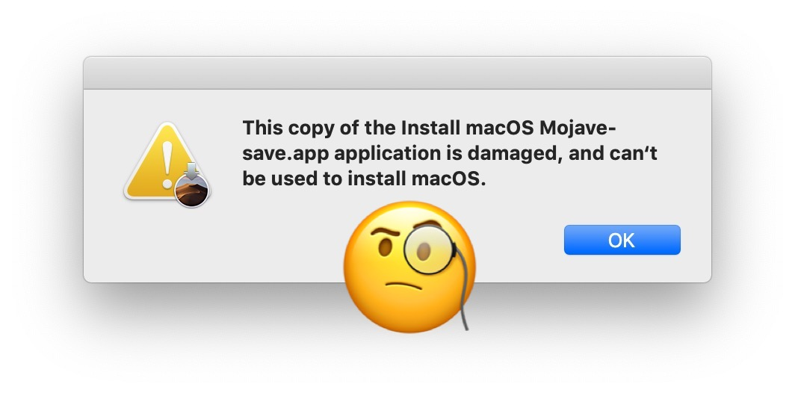

# 🤪 安装旧版本 macOS

## 背景

出于种种原因，要在一台苹果电脑上安装旧版本的 macOS 是一件不容易的事。因为苹果官网的下载链接会引导你到 App Store，当它发现你要下载的系统版本比你当前使用的系统还要旧的时候，是不会提供下载的，只能下载更新的版本。

前几天我一个朋友刚高中毕业，大学想要学计算机，我就推荐他买苹果电脑，但他之前都没用过 macOS，所以我打算把我那台 2014 年的 MacBook Air 给他体验一下。当时这台电脑的系统是 High Sierra 10.13，我想着搞个 USB 启动盘重装一下系统，顺手把磁盘的数据都抹掉，没想到这一顿操作以后，我人麻了。

我先是随便在网上找了一个镜像，因为苹果官网根本下载不了旧版本的 macOS，引导盘做好了之后，一切都很顺利，直到它给我来了个惊喜。

<figure><figcaption>
HUH?
</figcaption></figure>

## 证书过期

查了一下资料，发现是镜像的证书过期了，
